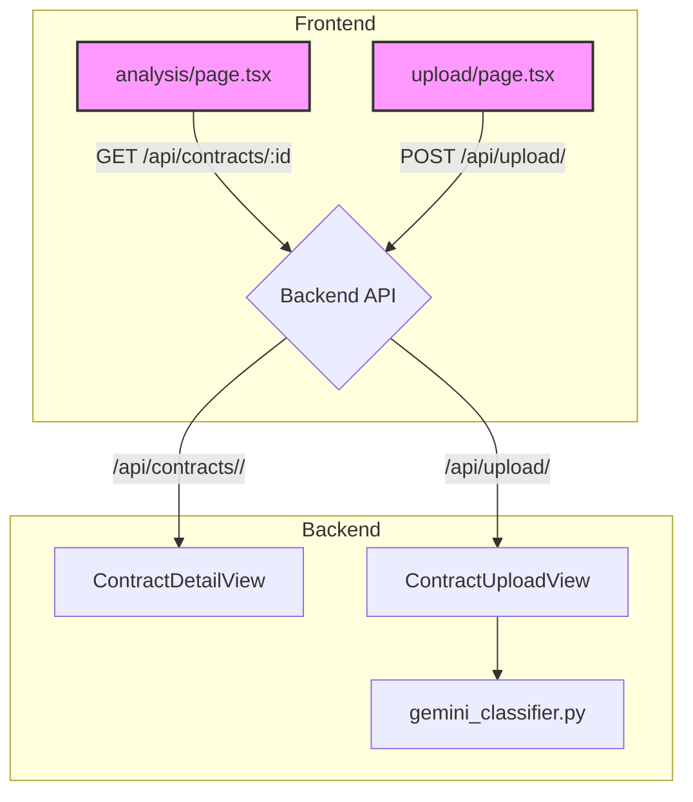

# API Mismatch Report and Resolution Plan

This document outlines the discrepancies between the frontend and backend API endpoints and proposes a plan to resolve them.

## 1. Mismatched Endpoints

### Backend Endpoint:
- **`POST /api/classify_clauses/`**: This endpoint is defined in the backend but is not currently used by the frontend.

### Frontend Calls:
- **`GET /api/contracts/${id}/`**: Used in `frontend/app/analysis/page.tsx` to fetch contract details. This endpoint does not exist in the backend.
- **`POST /api/upload/`**: Used in `frontend/app/upload/page.tsx` to upload contract files. This endpoint does not exist in the backend.

## 2. Proposed Solutions

To resolve these mismatches, I propose the following changes:

### Backend Changes:

1.  **Create a new endpoint for fetching contract details:**
    -   **URL:** `GET /api/contracts/<int:pk>/`
    -   **View:** Create a new `ContractDetailView` to handle retrieving a single contract by its ID.
    -   **File:** `backend/contract_app/views.py`, `backend/contract_app/urls.py`

2.  **Create a new endpoint for file uploads:**
    -   **URL:** `POST /api/upload/`
    -   **View:** Create a new `ContractUploadView` to handle file uploads and initiate the analysis process. This view can then call the `classify_clauses` logic internally.
    -   **File:** `backend/contract_app/views.py`, `backend/contract_app/urls.py`

### Frontend Changes:

1.  **No immediate changes are required** if the backend is updated to match the existing frontend calls. However, we should confirm that the data format returned by the new backend endpoints matches the frontend's expectations.

## 3. Implementation Plan

Here is a Mermaid diagram illustrating the proposed changes:

This plan will align the frontend and backend, enabling the application to function as intended.